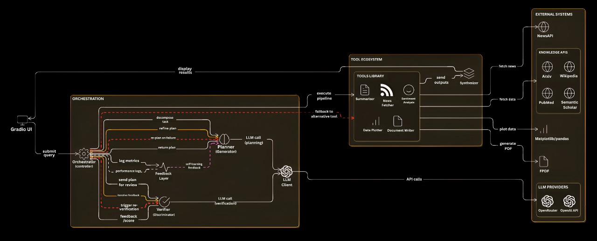

# 🧠 DualMind Orchestrator

A **GAN-Inspired Multi-Agent Task Planning & Execution System** that demonstrates intelligent task planning, tool usage, adversarial self-verification, and report generation.

## 🌟 Overview

DualMind Orchestrator is an advanced AI system that implements a **Generator-Discriminator architecture** inspired by Generative Adversarial Networks (GANs). It builds upon the concepts introduced by HuggingGPT while introducing several key innovations.

### Inspiration from HuggingGPT

DualMind draws inspiration from HuggingGPT's approach to task decomposition and tool utilization, but extends it with:

- **Adversarial Verification**: Unlike HuggingGPT's single-path execution, DualMind introduces a verifier that critically evaluates and improves plans
- **Iterative Refinement**: Plans are refined through multiple iterations based on verifier feedback
- **Fallback Mechanisms**: Robust error handling with automatic fallbacks when tools fail
- **Self-Improving Architecture**: The system learns from past executions to improve future performance

### Key Improvements Over Traditional Approaches

1. **Dual-Agent Architecture**: 
   - **Planner (Generator)**: Creates initial task pipelines
   - **Verifier (Discriminator)**: Critically evaluates and improves plans
   - Continuous feedback loop between agents leads to higher quality outputs

2. **Enhanced Tool Integration**:
   - Dynamic tool selection with fallback mechanisms
   - Tools are selected based on their suitability for specific subtasks
   - Automatic retry logic with exponential backoff

3. **Self-Verification**:
   - Every plan is automatically verified for quality and feasibility
   - Verification includes checking tool availability, parameter validation, and logical consistency
   - Plans are scored across multiple dimensions (relevance, completeness, logical flow, etc.)

4. **Improved Error Handling**:
   - Graceful degradation when tools fail
   - Automatic fallback to alternative tools or approaches
   - Detailed error reporting and recovery mechanisms

## ✨ Key Features

- 🤖 **Multi-Agent Architecture**: Planner and Verifier LLMs work together in an adversarial setup
- 🔧 **Extensible Tool System**: Modular tools for various tasks (research, summarization, analysis, visualization)
- ✅ **Self-Verification**: Automatic plan validation and improvement suggestions
- 📊 **Visual Interface**: Beautiful UI showing the complete reasoning process
- 📄 **PDF Report Generation**: Automatic creation of structured reports
- 🛠️ **Fallback Mechanisms**: Works even when APIs are unavailable (demo mode)

## 🚀 Quick Start

### Prerequisites

- Python 3.8+
- Node.js 16+ (for frontend)
- npm or yarn (for frontend dependencies)
- Conda (recommended) or virtualenv

### Installation

1. **Clone the repository**
   ```bash
   git clone <repository-url>
   cd DualMind
   ```

2. **Set up Python environment**
   ```bash
   # Create and activate conda environment
   conda create -n dualmind python=3.9
   conda activate dualmind
   
   # Install Python dependencies
   pip install -r requirements.txt
   ```

3. **Set up frontend**
   ```bash
   cd frontend
   npm install
   cd ..
   ```

4. **Environment Variables**
   Create a `.env` file in the project root with your API keys (if needed):
   ```
   OPENAI_API_KEY=your_api_key_here
   ```

### Running the Application

1. **Start the backend server** (Terminal 1)
   ```bash
   python api_server.py
   ```
   The API will be available at `http://localhost:8000`

2. **Start the frontend** (Terminal 2)
   ```bash
   # Navigate to frontend directory
   cd frontend
   
   # Install dependencies (first time only)
   npm install
   
   # Start development server
   npm run dev
   ```
   The frontend will be available at `http://localhost:5173`

## 🖥️ Frontend Development

### Available Scripts

In the `frontend` directory, you can run:

- `npm run dev` - Starts the development server with hot-reload
- `npm run build` - Builds the app for production to the `dist` folder
- `npm run preview` - Serves the production build locally for testing
- `npm run lint` - Runs ESLint to check code quality

### Project Structure

```
frontend/
├── src/               # Source files
│   ├── components/    # React components
│   ├── pages/         # Page components
│   ├── styles/        # Global styles
│   ├── utils/         # Utility functions
│   └── App.tsx        # Main App component
├── public/            # Static files
├── index.html         # Main HTML template
└── package.json       # Dependencies and scripts
```

### Building for Production

To create a production build:

```bash
cd frontend
npm run build
```

This will create an optimized build in the `dist` directory that you can deploy to any static hosting service.

### Testing the Production Build Locally

After building, you can test the production build locally with:

```bash
cd frontend
npm run preview
```

This will serve the production build at `http://localhost:4173`

## 🏗️ Architecture



### System Components

1. **Planner LLM (Generator)**
   - Creates initial task pipelines based on user queries
   - Breaks down complex tasks into executable steps
   - Selects appropriate tools for each subtask

2. **Verifier LLM (Discriminator)**
   - Critically evaluates plans for quality and feasibility
   - Provides feedback for iterative improvement
   - Scores plans across multiple dimensions

3. **Orchestrator**
   - Coordinates the entire execution flow
   - Manages communication between components
   - Handles error recovery and fallbacks

4. **Tool Chain**
   - Collection of specialized tools for different tasks
   - Tools are selected dynamically based on requirements
   - Supports fallback mechanisms for robustness

## 🧰 Available Tools

1. **ArXiv Summarizer**: Fetches and summarizes academic papers
2. **Wikipedia Search**: Retrieves information from Wikipedia
3. **News Fetcher**: Gets latest news articles
4. **Sentiment Analyzer**: Performs sentiment analysis on text
5. **Data Plotter**: Creates visualizations (charts, graphs)
6. **QA Engine**: Answers questions using LLM
7. **Document Writer**: Generates PDF reports

## 🚀 Quick Start

### 1. Installation

```bash
# Clone or download the project
cd dualmind_orchestrator

# Install dependencies
pip install -r requirements.txt

# Optional: Install PyTorch for better transformer performance
pip install torch torchvision torchaudio --index-url https://download.pytorch.org/whl/cpu
```

### 2. Configuration

1. Copy the `.env` file:
   ```bash
   cp .env .env.local
   ```

2. Edit `.env.local` and add your API keys:
   ```env
   OPENROUTER_API_KEY=your_openrouter_api_key_here
   NEWSAPI_KEY=your_newsapi_key_here  # Optional
   ```

3. Get free API keys:
   - **OpenRouter**: https://openrouter.ai/ (for LLM access)
   - **NewsAPI**: https://newsapi.org/ (optional, for news fetching)

### 3. Run the System

```bash
python main.py
```

The system will start a Gradio interface at `http://localhost:7860`

## 📖 Usage Examples

### Example 1: Research & Report Generation
```
Query: "Summarize recent AI breakthroughs in climate research and generate a visual report."
```

**System Response:**
- 📋 **Planning**: Creates a 4-step pipeline (research → news → analysis → report)
- 🔍 **Verification**: Validates plan logic and tool selection
- ⚙️ **Execution**: Runs tools sequentially with progress tracking
- 📄 **Output**: Comprehensive PDF report with visualizations

### Example 2: Data Analysis & Visualization
```
Query: "Analyze sentiment in recent news about renewable energy and visualize the trends."
```

**System Response:**
- 📋 **Planning**: Selects news fetching and sentiment analysis tools
- 🔍 **Verification**: Ensures proper data flow and analysis approach
- ⚙️ **Execution**: Processes articles and creates sentiment visualizations
- 📊 **Output**: Sentiment trend charts and analysis summary

## 🔧 Tool Development

### Adding New Tools

1. Create a new file in `tools/` directory:
   ```python
   # tools/my_new_tool.py
   def my_new_tool(input_data: str) -> str:
       # Tool implementation
       return "Tool output"
   ```

2. Update `tools_description.json`:
   ```json
   {
     "name": "my_new_tool",
     "description": "Description of what the tool does",
     "input": "input description",
     "output": "output description"
   }
   ```

3. The system will automatically discover and use the new tool!

## 🧪 Demo Mode

The system includes intelligent fallbacks for when APIs are unavailable:

- **LLM Fallbacks**: Predefined responses for common queries
- **News Fallbacks**: Demo articles for testing
- **PDF Generation**: Always works with local libraries
- **All Features**: Fully functional even without API keys

## 📁 Project Structure

```
dualmind_orchestrator/
├── main.py                 # Entry point
├── planner.py             # Planner LLM (Generator)
├── verifier.py            # Verifier LLM (Discriminator)
├── orchestrator.py        # Coordination logic
├── ui.py                  # Gradio interface
├── tools/                 # Tool implementations
│   ├── arxiv_summarizer.py
│   ├── wikipedia_search.py
│   ├── news_fetcher.py
│   ├── sentiment_analyzer.py
│   ├── data_plotter.py
│   ├── qa_engine.py
│   └── document_writer.py
├── tools_description.json # Tool definitions
├── requirements.txt       # Python dependencies
├── .env                   # Environment configuration
├── logs/                  # Execution logs
└── output/                # Generated files (PDFs, charts)
```

## 🔬 Technical Details

### GAN-Inspired Design

- **Generator (Planner)**: Creates task plans that maximize utility
- **Discriminator (Verifier)**: Evaluates plans for correctness and efficiency
- **Adversarial Training**: Iterative improvement through feedback loops

### Key Innovations

1. **Dynamic Tool Selection**: Intelligent matching of queries to available tools
2. **Self-Verification**: Automatic detection of plan flaws and inefficiencies
3. **Fallback Resilience**: Graceful degradation when external services fail
4. **Transparent Reasoning**: Full visibility into AI decision-making process

## 🐛 Troubleshooting

### Common Issues

1. **Import Errors**: Ensure all requirements are installed
   ```bash
   pip install -r requirements.txt
   ```

2. **API Key Issues**: Use demo/fallback mode for testing
   ```bash
   # The system works without API keys in demo mode
   OPENROUTER_API_KEY=demo_key
   ```

3. **Port Conflicts**: Change the default port
   ```bash
   python main.py --port 8080
   ```

4. **Memory Issues**: For large reports, ensure sufficient RAM (4GB+ recommended)
## 🎥 Project Demo

Check out our video demonstration to see DualMind in action:

[](https://youtu.be/VbCKU45HYY0))


## 📈 Performance Tips

- Use CPU-optimized PyTorch for better performance
- Enable GPU acceleration if available for transformer models
- Monitor logs for performance bottlenecks
- Use the `--log-level DEBUG` flag for detailed diagnostics

## 🤝 Contributing

Contributions are welcome! Areas for improvement:

- [ ] Enhanced tool discovery and composition
- [ ] Advanced verification algorithms
- [ ] Memory and context management
- [ ] Performance optimizations
- [ ] Additional tool integrations

## 📄 License

This project is for educational and demonstration purposes. Please respect API terms of service.

## 🙏 Acknowledgments

- Inspired by HuggingGPT and other multi-agent AI systems
- Built with open-source tools and free-tier APIs
- Thanks to the AI research community for advancing these concepts

---


